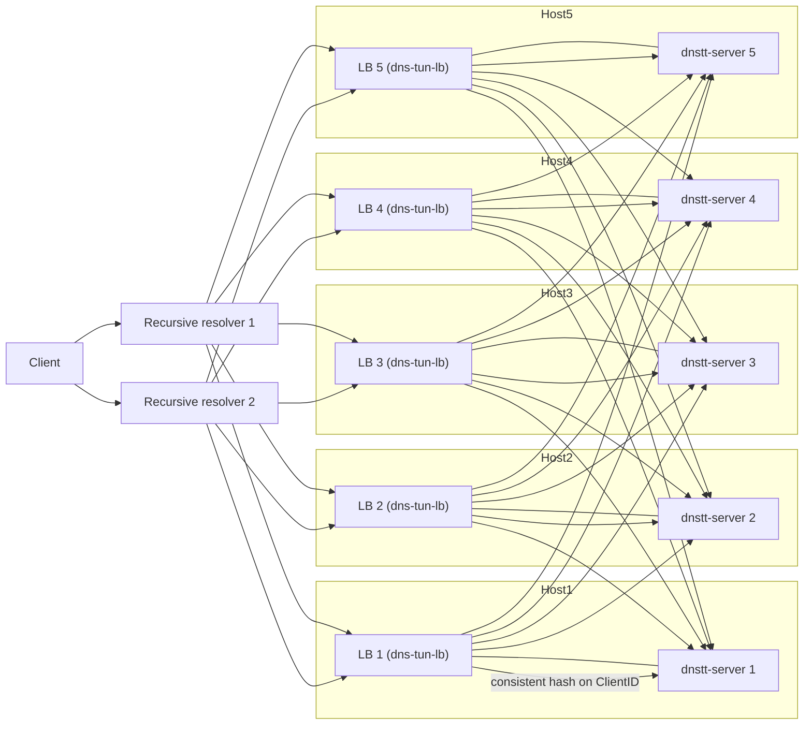

## dns-tun-lb (DNS tunnel load balancer)

`dns-tun-lb` is a small, stateless UDP load balancer for DNS tunneling
protocols. It currently supports **dnstt** and will be extended to support
**slipstream** later.

The LB:

- Listens on a single UDP address (typically port 53 behind DNAT).
- Parses incoming DNS queries.
- Detects dnstt tunnel traffic based on QNAME and EDNS(0) shape.
- Extracts the dnstt `ClientID` as a session identifier.
- Uses a consistent hash ring to route each tunnel session to a backend
  `dnstt-server`, providing per-session stickiness.
- For non-tunnel DNS, either forwards to a recursive resolver or drops the
  packet, depending on configuration.

The LB is **stateless per node**: there are no health checks, no shared
state, and no coordination between instances. Given the same configuration,
different instances will make the same routing decision for a given packet.

---

### Quick start

#### Local binary

Prereqs:

- Go 1.22+ (tested with Go 1.24).

Build and run from `dns-tunnel/dns-tunnel-lb`:

```bash
go build -o dns-tun-lb .
./dns-tun-lb -config lb.yaml
```

`lb.yaml` is just an example; in production you should supply your own config
with your real listen address, tunnel domains, backends, and resolver policy.

Run with `logging.level: "debug"` to see which backend each dnstt session
maps to.

#### Docker

Build the image:

```bash
docker build -t dns-tun-lb .
```

Run binding UDP/53 on the host:

```bash
docker run --rm \
  -p 53:53/udp \
  --cap-add=NET_BIND_SERVICE \
  -v $(pwd)/lb.yaml:/etc/dns-tun-lb.yaml:ro \
  --name dns-tun-lb \
  dns-tun-lb
```

---

### Configuration

Configuration is provided as a YAML file (passed with `-config`, default
`lb.yaml`).

```yaml
global:
  listen_address: "0.0.0.0:53"

  default_dns_behavior:
    mode: "forward"          # "forward" | "drop"
    forward_resolver: "9.9.9.9:53"

protocols:
  dnstt:
    pools:
      - name: "dnstt-main"
        domain_suffix: "t.example.com"
        backends:
          - id: "dnstt-1"
            address: "10.0.0.11:5300"
          - id: "dnstt-2"
            address: "10.0.0.12:5300"
          - id: "dnstt-3"
            address: "10.0.0.13:5300"
          - id: "dnstt-4"
            address: "10.0.0.14:5300"
          - id: "dnstt-5"
            address: "10.0.0.15:5300"

logging:
  level: "info"              # "error" | "info" | "debug"
```

For the same pool, a minimal **authoritative DNS configuration** for a cluster
of 5 load balancers might look like this:

```text
; Load balancer addresses
tns1.example.com.   IN  A     203.0.113.10
tns2.example.com.   IN  A     203.0.113.11
tns3.example.com.   IN  A     203.0.113.12
tns4.example.com.   IN  A     203.0.113.13
tns5.example.com.   IN  A     203.0.113.14

; Delegate the tunnel zone to the LBs
t.example.com.      IN  NS    tns1.example.com.
t.example.com.      IN  NS    tns2.example.com.
t.example.com.      IN  NS    tns3.example.com.
t.example.com.      IN  NS    tns4.example.com.
t.example.com.      IN  NS    tns5.example.com.
```

- **`global.listen_address`**: UDP address the LB listens on. In production
  you typically run on an unprivileged port and DNAT external UDP/53 to this
  address.
- **`default_dns_behavior`**:
  - `mode: "forward"`: forward non-tunnel DNS to `forward_resolver` and
    relay responses.
  - `mode: "drop"`: silently drop non-tunnel DNS.
  - If `mode: "forward"` is set, `forward_resolver` is required; otherwise
    the LB will fail to start.
- **`protocols.dnstt.pools[]`**:
  - `domain_suffix`: QNAME suffix that identifies a dnstt tunnel zone
    (for example `t.example.com`). The LB will match queries whose names
    are subdomains of this suffix.
  - `backends[]`: UDP endpoints of `dnstt-server` instances that terminate
    tunnels for this suffix.
- **`logging.level`**:
  - `"error"`: only errors.
  - `"info"`: high-level lifecycle and summary (default).
  - `"debug"`: per-session routing and pool details.

---

### dnstt detection and session stickiness

For each incoming DNS query:

- The LB parses the DNS message and considers it dnstt only if:
  - Exactly one question.
  - `QTYPE = TXT`, `QCLASS = IN`.
  - At least one EDNS(0) OPT record is present.
  - QNAME ends with a configured dnstt `domain_suffix`.
  - The QNAME prefix (before the suffix) is a valid base32 encoding of a
    dnstt payload with a leading 8-byte `ClientID`.
- The LB extracts the 8-byte `ClientID` from the decoded prefix and uses it
  as the session identifier.
- The backend selection key is the tuple:
  - `protocol = "dnstt"`
  - `domain_suffix`
  - `ClientID` bytes
- A per-pool consistent hash ring maps this key to a backend. All packets
  for the same tunnel (same `ClientID`) go to the same backend, as long as
  the pool membership is unchanged.

Packets not classified as dnstt are handled according to
`default_dns_behavior`.

---

### End-to-end flow diagram



---

### Future work / TODO

- **Add slipstream protocol support**: implement slipstream QUIC/DCID-based detection and session ID extraction alongside dnstt.
- **Add server weight**: support per-backend weights in the consistent hash ring to bias load toward larger servers.
- **Add max connections per server**: enforce a soft cap on active sessions per backend and optionally spill to others.
- **Add health checks**: periodically probe backends and temporarily avoid routing new sessions to unhealthy ones.
- **Add load balancer clustering to share health state**: exchange health information between LB instances so they make consistent routing decisions based on shared view of backend status.

